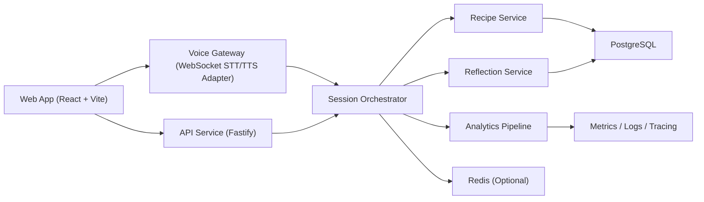

# KitchenWithMe MVP 技术选型与技术设计（整合版）

## 快速摘要（3 分钟）

- 这份文档的目标：在“语音体验优先”前提下，为 KitchenWithMe MVP 选择可落地、可演进的技术方案。
- 当前已确认：
  - 语音链路走 `WebSocket + STT/TTS` 分离编排
  - 保留 `Voice Gateway` 抽象层
  - 指标目标为 `P50 <= 1.5s`、`P95 <= 2.5s`、打断 `< 600ms`
- 当前候选主路径：
  - 平衡型：OpenAI Agents SDK + LiveKit Agents + Voice Gateway
  - 托管型：OpenAI Agents/Codex + ElevenLabs + Voice Gateway
- 推荐阅读顺序：
  - 先看 `2. 决策输入`（已确认和待拍板）
  - 再看 `5. 调研总表`（横向对比）
  - 最后看 `7. 候选落地组合`（可执行路线）

## 目录

1. 文档信息
2. 决策输入
3. 架构范式总览
4. KitchenWithMe 目标架构
5. 调研总表
6. 深度调研
7. KitchenWithMe 候选落地组合
8. X 平台独立开发者样本
9. 社区活跃度（GitHub）
10. 主要风险与缓解
11. 下一步执行建议
12. 调研来源

## 1. 文档信息

- 版本：v0.3（整合版）
- 日期：2026-02-21
- 状态：讨论中（非最终拍板）
- 适用范围：Web MVP
- 关联文档：
  - `docs/prd/core/2026-02-21-kitchenwithme-mvp-prd.md`
  - `docs/prd/handoff/2026-02-21-kitchenwithme-mvp-engineering-handoff.md`
  - `docs/prd/plans/2026-02-21-kitchenwithme-mvp-design.md`

## 2. 决策输入（先看这一节）

### 2.1 已确认结论

- 优先级：语音体验优先
- 语音链路方向：`WebSocket + STT/TTS 分离编排`（路线 2）
- 性能目标：
  - 语音响应延迟：`P50 <= 1.5s`，`P95 <= 2.5s`
  - 打断响应：`< 600ms`
- 架构约束：必须保留 `Voice Gateway` 抽象层，降低后续升级与供应商切换成本

### 2.2 待拍板事项

1. Agent runtime 语言：TypeScript 还是 Python
2. Agent 执行内核：OpenAI Agents SDK / OpenAI Codex SDK / `pi-mono`
3. Voice 执行层：LiveKit Agents / Pipecat / ElevenLabs 托管语音层
4. Skills 映射规范：`SKILL.md -> tool schema` 最小字段与治理策略
5. PoC 验证口径：延迟、打断成功率、误打断率、兜底触发率

## 3. 架构范式总览

### 3.1 语音 Agent 常见架构范式

| 范式 | 主链路 | 优点 | 风险 | 适配结论 |
| --- | --- | --- | --- | --- |
| 分离式编排（当前路线） | `STT -> LLM/Agent -> TTS` | 可控、可替换、易做兜底 | 延迟和打断体验通常弱于端到端实时 | 适合 MVP 起步 |
| 端到端实时语音 | 语音直接进实时模型并回音频 | 实时性和自然感最好 | 绑定更强、治理更复杂 | 可作为后续升级方向 |
| 语音框架编排 | LiveKit/Pipecat 管理语音回路 | turn/打断能力成熟 | 学习与运维成本高 | 适合中期演进 |
| Agent 运行时中心 | Agent runtime + 外接语音层 | skills/tool 治理清晰 | 语音层需自行补齐 | 适合治理型团队 |
| 托管语音平台 | 平台托管 STT/LLM/TTS | 上线快、运维负担低 | 锁定与成本风险 | 适合快速验证 |

### 3.2 技术底座备选（历史方案保留）

| 方案 | 核心栈 | 优点 | 风险 | 当前优先级 |
| --- | --- | --- | --- | --- |
| A. TypeScript Monorepo | React + Fastify + WS + PostgreSQL | 全栈一致、协作成本低 | 需自建服务运维 | 高 |
| B. BaaS 优先 | React + Functions + 托管 DB | 起步快 | 语音编排可控性弱 | 中 |
| C. Edge Serverless | Edge Functions + KV/DB | 全球低延迟潜力 | 本地调试和语音链路复杂 | 中低 |

## 4. KitchenWithMe 目标架构（基于已确认输入）

### 4.1 模块职责

- Web App：页面流（今日开火 -> 会话 -> 轻记录 -> 历史）与会话 UI 状态机
- Voice Gateway：语音输入输出、打断、重试、降级、供应商隔离
- Session Orchestrator：session 生命周期、步骤推进、计时器、意图路由
- Data Services：
  - `recipe-service`：菜谱与步骤
  - `reflection-service`：味觉/心情记录
  - `analytics`：埋点与质量指标

### 4.2 数据与接口（MVP）

- 核心表：
  - `sessions(id, recipe_id, status, current_step, created_at, updated_at)`
  - `reflections(id, session_id, taste_note, mood_note, created_at)`
  - `events(id, event_name, session_id, payload_json, timestamp)`
- API：
  - `GET /api/recipes`
  - `POST /api/sessions`
  - `GET /api/sessions/{session_id}`
  - `POST /api/reflections`
  - `GET /api/reflections?date=YYYY-MM-DD`
  - `WS /api/realtime/sessions/{session_id}`

### 4.3 非功能目标

- 性能：`P50 <= 1.5s`、`P95 <= 2.5s`、打断 `< 600ms`
- 业务：主链路完成率 `> 60%`
- 测试：单元 + 集成 + E2E（含权限拒绝/弱网/STT/TTS 失败）
- 可观测：`stt_latency`、`tts_latency`、`fallback_trigger_rate`、`voice_error_rate`

## 5. 调研总表（先横看，再纵看）

### 5.1 Agent 主循环/技能层对比

| 方案 | 主循环成熟度 | Skills/工具注入 | 执行治理 | 语音原生性 | 结论 |
| --- | --- | --- | --- | --- | --- |
| `pi-mono` | 中高 | 高（SKILL.md 形态贴近） | 中 | 低 | 适合技能编排，不是语音主引擎 |
| OpenAI Agents SDK | 高 | 高（tools + MCP） | 中高 | 中 | 适合做主循环基座 |
| OpenAI ChatKit | 中（UI/交互层） | 中 | 中 | 低 | 适合作前台壳层，不替代 runtime |
| OpenAI Codex SDK (TS) | 高（Thread/Event） | 高（tools/MCP 事件） | 高（沙箱/审批） | 低 | 适合治理型执行内核 |
| LangGraph / AutoGen / CrewAI | 中高 | 中高 | 中 | 低 | 适合复杂多 agent 流程升级 |

### 5.2 Voice 执行层对比

| 方案 | STT/TTS 实时能力 | 打断/turn 能力 | 可定制性 | 运维负担（越低越好） | 结论 |
| --- | --- | --- | --- | --- | --- |
| LiveKit Agents | 高 | 高 | 中高 | 中 | 综合最平衡 |
| Pipecat | 高 | 高 | 高 | 低 | 上限高但复杂 |
| openai-realtime-agents | 中高（示例） | 中高 | 中 | 中 | 适合官方模式 PoC |
| ElevenLabs 托管平台 | 中高 | 中高 | 中 | 高 | 快速上线、锁定风险较高 |

## 6. 深度调研（按方案）

### 6.1 `livekit/agents`

- 定位：Realtime voice AI agents framework
- 主循环：Worker + Job Dispatch + Agent Session，天然适配“语音会话即会话房间”
- skills/tool：`@function_tool`，支持 provider native tools 与 MCP
- 语音能力：`stt/llm/tts/vad` 插件化，turn detection 与打断参数可调
- 运维：支持开发/生产部署与扩缩容建议
- 适配结论：语音体验和工程平衡最佳，适合当前路线外接 Voice Gateway

### 6.2 `pipecat-ai/pipecat`

- 定位：语音/多模态对话 AI 编排框架
- 主循环：`Pipeline / Frame Processor / Transport / Services`
- skills/tool：`FunctionSchema`、`ToolsSchema`、`register_function`、MCP 工具注册
- 语音能力：强调可中断、支持多 provider，turn 策略可细粒度调优
- 运维：灵活但复杂，要求较强 pipeline 调优能力
- 适配结论：可塑性最高，适合中后期深度定制

### 6.3 `openai/openai-realtime-agents`

- 定位：Realtime voice agents 官方高级模式示例
- 形态：`chat-supervisor`、`sequential-handoffs` 等多 agent 模式
- skills/tool：tool call 触发 handoff + `session.update` 动态更新工具集
- 语音能力：依托 OpenAI Realtime 事件流，适合快速验证多 agent 语音交互
- 风险：示例仓库属性明显，生产治理需自行补齐
- 适配结论：很适合 PoC 基准，不建议直接作为最终生产基线

### 6.4 `openai/codex` TypeScript SDK

- 定位：Codex CLI 的 TypeScript SDK（执行内核）
- 主循环：`Codex -> Thread -> Event Stream`，支持 `run()/runStreamed()`
- skills/tool：`mcp_tool_call`、`custom_tool_call`、`function_call`、事件可审计
- 执行治理：`sandboxMode`、`approvalPolicy`、`workingDirectory` 等策略可控
- 语音能力：无内建 STT/TTS/VAD/turn，需外接语音层
- 适配结论：治理优势明显，适合“Agent 执行层”而非语音底座

### 6.5 ElevenLabs Conversational AI / Agents Platform

- 定位：托管式 Conversational AI 平台
- 架构：平台托管语音链路（STT + LLM orchestration + TTS）
- skills/tool：`Tools`、`Knowledge Base`、`Conversation Flow`、webhook 集成
- 语音能力：turn-taking、interruption handling、voice controls、WebSocket 接入
- 运维：基础设施负担低，但供应商锁定与成本波动需关注
- 适配结论：上线速度快，适合早期验证和运营试错

### 6.6 Agent runtime 补充观察（非 voice-first）

- `pi-mono`：SKILL.md 形态最贴近，适合作为技能编排层
- OpenAI Agents SDK：主循环能力完整，长期演进稳定
- OpenAI ChatKit：偏前端交互层，适合嵌入式 chat UI
- LangGraph/AutoGen/CrewAI：适合复杂多 agent 任务，不是语音优先最短路径

## 7. KitchenWithMe 候选落地组合（讨论稿）

### 7.1 组合 A（平衡型，优先验证）

- Agent 主循环：OpenAI Agents SDK
- Voice 执行层：LiveKit Agents
- 语音抽象：自建 `Voice Gateway`
- skills 注入：`SKILL.md -> tools/MCP`
- 结论：语音体验、治理与演进平衡最好

### 7.2 组合 B（定制型）

- Agent 主循环：OpenAI Agents SDK 或 `pi-mono`
- Voice 执行层：Pipecat
- 抽象层：`Voice Gateway` + provider adapter
- 结论：上限高，但 MVP 周期风险较高

### 7.3 组合 C（官方 PoC 型）

- 语音链路参考：`openai-realtime-agents`
- 目标：2-5 天跑通“会话 + 工具 + TTS”最小闭环
- 结论：适合快速验证，不宜直接生产化

### 7.4 组合 D（治理型执行内核）

- Agent 主循环：OpenAI Codex SDK（TS）
- Voice 执行层：独立 `Voice Gateway`
- skills 注入：`SKILL.md -> tools/MCP`
- 结论：审计与治理强，但语音层建设成本高

### 7.5 组合 E（托管语音型）

- Agent 主循环：OpenAI Agents SDK / OpenAI Codex SDK / `pi-mono`
- Voice 执行层：ElevenLabs Conversational AI
- 抽象层：`Voice Gateway` 保留契约
- 结论：上线快，需重点管理锁定与成本

## 8. X 平台独立开发者样本（补充）

> 采样说明：2026-02-21 对 X 直链检索存在登录/反爬限制，本节基于可公开访问的样本汇总，属于趋势观察，不是严格统计。

### 8.1 高频组合（样本观察）

- 自动化导向：`n8n + 语音平台（ElevenLabs/Retell/Bland）+ CRM`
- 实时体验导向：`LiveKit/Pipecat + STT + LLM + TTS`
- Agent 工具导向：`OpenAI Agents SDK + MCP/tools`（语音层外接）
- 快速样机导向：`openai-realtime-agents` 先跑通闭环

### 8.2 近期观点样本（2025-12 至 2026-02）

| 时间锚点 | X 用户 / 帖子 | 观点摘要 | 倾向方案 |
| --- | --- | --- | --- |
| 2026-02-10 | `@Zimbilazim` | n8n 默认前端不足，倾向“n8n 后端 + 自建前端” | 工作流后端 + 自定义前端 |
| 2025-12-19 周 | `@ClementDelangue` | 强调语音 agent 快速迁移与集成速度 | 实时语音 API 快速集成 |
| 2025-08-22 周 | `@rohan_tib` | 优先几分钟级原型速度 | 极速 PoC |
| 2025-07-18 周 | `@Asoft001` | `n8n + Retell` 做 24/7 外呼与 CRM 自动化 | 分离式 + 工作流 |
| 2025-07-18 周 | `@alxberman` | `Bland + n8n` 冷呼叫，强调业务闭环 | 语音平台 + 工作流 |
| 2025-07-05 周 | `@nateherk` | 让 AI 生成 n8n workflow 降低搭建成本 | Agent 生成工作流 |
| 2025-07-04 周 | `@Tomas_Kenny` | 40 分钟内拼出多工具流程，先跑通再优化 | 多工具快速拼装 |
| 2025-07-04 周 | `@gillinghammer` | MCP 语音支持不足时自建 voice bridge | MCP + 语音桥接 |
| 2025-05-30 周 | `@TheVeller` | 用 n8n 做 LLM Router 优化成本性能 | 多模型路由 |

### 8.3 对 KitchenWithMe 的启发

- 独立开发者普遍先追求“业务闭环”，再优化语音自然度
- `方案2 + Voice Gateway` 仍是稳妥 MVP 路线
- 应尽早固化 `skills -> tools/MCP` 映射，减少后续重构成本

## 9. 社区活跃度（GitHub）

> 统计时间：2026-02-21（UTC）  
> 指标口径：`Stars = stargazers_count`，`上次更新时间 = pushed_at`

| 方案/仓库 | Stars | 上次更新时间 (UTC) |
| --- | ---: | --- |
| `badlogic/pi-mono` | 14,230 | 2026-02-19T23:18:37Z |
| `openai/openai-agents-js` | 2,309 | 2026-02-20T23:02:25Z |
| `openai/openai-agents-python` | 19,044 | 2026-02-20T22:55:40Z |
| `openai/openai-chatkit-advanced-samples` | 578 | 2026-01-21T20:00:14Z |
| `openai/openai-realtime-agents` | 6,773 | 2026-01-07T18:38:52Z |
| `livekit/agents` | 9,374 | 2026-02-20T22:14:01Z |
| `pipecat-ai/pipecat` | 10,372 | 2026-02-21T00:43:06Z |
| `langchain-ai/langgraphjs` | 2,557 | 2026-02-21T01:10:03Z |
| `microsoft/autogen` | 54,676 | 2026-01-22T16:27:56Z |
| `crewAIInc/crewAI` | 44,357 | 2026-02-20T23:22:41Z |
| `openai/codex` | 61,241 | 2026-02-21T02:40:14Z |
| `elevenlabs/elevenlabs-python` | 2,873 | 2026-02-20T16:14:40Z |
| `elevenlabs/elevenlabs-js` | 387 | 2026-02-19T21:12:17Z |
| `elevenlabs/elevenlabs-mcp` | 1,225 | 2026-01-15T14:11:19Z |
| `elevenlabs/elevenlabs-swift-sdk` | 103 | 2026-02-10T12:27:48Z |

## 10. 主要风险与缓解

- 供应商稳定性波动
  - 缓解：`Voice Gateway` + provider adapter + fallback 语义统一
- 会话状态复杂导致回归
  - 缓解：状态机驱动 + 事件序列集成测试
- 供应商绑定/成本失控
  - 缓解：工具契约独立、语音层隔离、定期替换演练
- 范围膨胀影响交付
  - 缓解：严格按 PRD 的 P0/P1/P2 与本节待拍板事项执行

## 11. 下一步执行建议

1. 在 1 周内完成 `组合 A` 与 `组合 E` 的并行 PoC（同指标口径）
2. 固化 `SKILL.md -> tool schema` v0.1（name/description/inputs/outputs/safety）
3. 输出语音事件契约 v0.1（turn、interrupt、fallback、retry）
4. 基于 PoC 指标做最终拍板

## 12. 调研来源

- `pi-mono` 与 OpenClaw
  - [https://github.com/badlogic/pi-mono](https://github.com/badlogic/pi-mono)
  - [https://raw.githubusercontent.com/badlogic/pi-mono/main/packages/coding-agent/README.md](https://raw.githubusercontent.com/badlogic/pi-mono/main/packages/coding-agent/README.md)
- OpenAI Agents / Realtime / ChatKit / Codex SDK
  - [https://openai.github.io/openai-agents-js/](https://openai.github.io/openai-agents-js/)
  - [https://openai.github.io/openai-agents-python/](https://openai.github.io/openai-agents-python/)
  - [https://github.com/openai/openai-realtime-agents](https://github.com/openai/openai-realtime-agents)
  - [https://developers.openai.com/topics/chatkit](https://developers.openai.com/topics/chatkit)
  - [https://github.com/openai/openai-chatkit-advanced-samples](https://github.com/openai/openai-chatkit-advanced-samples)
  - [https://github.com/openai/codex/tree/main/sdk/typescript](https://github.com/openai/codex/tree/main/sdk/typescript)
  - [https://raw.githubusercontent.com/openai/codex/main/sdk/typescript/README.md](https://raw.githubusercontent.com/openai/codex/main/sdk/typescript/README.md)
  - [https://raw.githubusercontent.com/openai/codex/main/sdk/typescript/src/threadOptions.ts](https://raw.githubusercontent.com/openai/codex/main/sdk/typescript/src/threadOptions.ts)
  - [https://raw.githubusercontent.com/openai/codex/main/sdk/typescript/src/items.ts](https://raw.githubusercontent.com/openai/codex/main/sdk/typescript/src/items.ts)
  - [https://raw.githubusercontent.com/openai/codex/main/sdk/typescript/src/events.ts](https://raw.githubusercontent.com/openai/codex/main/sdk/typescript/src/events.ts)
- ElevenLabs
  - [https://elevenlabs.io/docs/conversational-ai/overview](https://elevenlabs.io/docs/conversational-ai/overview)
  - [https://elevenlabs.io/docs/conversational-ai/conversation-flow](https://elevenlabs.io/docs/conversational-ai/conversation-flow)
  - [https://elevenlabs.io/docs/agents-platform/conversational-ai/features/turn-taking](https://elevenlabs.io/docs/agents-platform/conversational-ai/features/turn-taking)
  - [https://elevenlabs.io/docs/agents-platform/conversational-ai/features/interruption-handling](https://elevenlabs.io/docs/agents-platform/conversational-ai/features/interruption-handling)
  - [https://elevenlabs.io/docs/conversational-ai/customization/voice-controls](https://elevenlabs.io/docs/conversational-ai/customization/voice-controls)
  - [https://elevenlabs.io/docs/conversational-ai/conversational-ai/websocket](https://elevenlabs.io/docs/conversational-ai/conversational-ai/websocket)
  - [https://elevenlabs.io/docs/conversational-ai/customization/monitoring](https://elevenlabs.io/docs/conversational-ai/customization/monitoring)
  - [https://github.com/elevenlabs/elevenlabs-python](https://github.com/elevenlabs/elevenlabs-python)
  - [https://github.com/elevenlabs/elevenlabs-js](https://github.com/elevenlabs/elevenlabs-js)
  - [https://github.com/elevenlabs/elevenlabs-mcp](https://github.com/elevenlabs/elevenlabs-mcp)
- LiveKit / Pipecat
  - [https://github.com/livekit/agents](https://github.com/livekit/agents)
  - [https://docs.livekit.io/agents/build/tools/](https://docs.livekit.io/agents/build/tools/)
  - [https://docs.livekit.io/agents/build/turns/turn-detector/](https://docs.livekit.io/agents/build/turns/turn-detector/)
  - [https://docs.livekit.io/agents/ops/deployment/](https://docs.livekit.io/agents/ops/deployment/)
  - [https://docs.livekit.io/agents/integrations/mcp/](https://docs.livekit.io/agents/integrations/mcp/)
  - [https://github.com/pipecat-ai/pipecat](https://github.com/pipecat-ai/pipecat)
  - [https://docs.pipecat.ai/guides/learn/pipeline](https://docs.pipecat.ai/guides/learn/pipeline)
  - [https://docs.pipecat.ai/guides/learn/function-calling/function-schema](https://docs.pipecat.ai/guides/learn/function-calling/function-schema)
  - [https://docs.pipecat.ai/guides/learn/function-calling/tools-schema](https://docs.pipecat.ai/guides/learn/function-calling/tools-schema)
  - [https://docs.pipecat.ai/server/utilities/mcp-client](https://docs.pipecat.ai/server/utilities/mcp-client)
  - [https://docs.pipecat.ai/server/utilities/user-turn-strategies](https://docs.pipecat.ai/server/utilities/user-turn-strategies)
  - [https://docs.pipecat.ai/guides/learn/supported-services](https://docs.pipecat.ai/guides/learn/supported-services)
- 其他编排框架
  - [https://github.com/langchain-ai/langgraphjs](https://github.com/langchain-ai/langgraphjs)
  - [https://github.com/microsoft/autogen](https://github.com/microsoft/autogen)
  - [https://github.com/crewAIInc/crewAI](https://github.com/crewAIInc/crewAI)
- X 样本观察（可公开访问）
  - [https://ethanbholland.com/2025/07/18/audio-ai-news-week-ending-07-18-2025/](https://ethanbholland.com/2025/07/18/audio-ai-news-week-ending-07-18-2025/)
  - [https://ethanbholland.com/2025/07/04/audio-ai-news-week-ending-07-04-2025/](https://ethanbholland.com/2025/07/04/audio-ai-news-week-ending-07-04-2025/)
  - [https://ethanbholland.com/2025/12/19/x-ai-news-week-ending-12-19-2025/](https://ethanbholland.com/2025/12/19/x-ai-news-week-ending-12-19-2025/)
  - [https://ethanbholland.com/2025/08/23/ai-news-99-week-ending-august-22-2025-with-37-executive-summaries-top-34-links-and-3-helpful-visuals/](https://ethanbholland.com/2025/08/23/ai-news-99-week-ending-august-22-2025-with-37-executive-summaries-top-34-links-and-3-helpful-visuals/)
  - [https://ethanbholland.com/2025/07/05/ai-news-92-week-ending-july-04-2025-with-24-executive-summaries-top-72-links-and-3-helpful-visuals/](https://ethanbholland.com/2025/07/05/ai-news-92-week-ending-july-04-2025-with-24-executive-summaries-top-72-links-and-3-helpful-visuals/)
  - [https://ethanbholland.com/2025/05/30/agents-and-copilots-ai-news-week-ending-05-30-2025/](https://ethanbholland.com/2025/05/30/agents-and-copilots-ai-news-week-ending-05-30-2025/)
  - [https://ethanbholland.com/2025/07/04/agents-and-copilots-ai-news-week-ending-07-04-2025/](https://ethanbholland.com/2025/07/04/agents-and-copilots-ai-news-week-ending-07-04-2025/)
  - [https://ethanbholland.com/2025/05/09/agents-and-copilots-ai-news-week-ending-05-09-2025/](https://ethanbholland.com/2025/05/09/agents-and-copilots-ai-news-week-ending-05-09-2025/)
  - [https://ethanbholland.com/2025/04/24/agents-and-copilots-ai-news-week-ending-04-25-2025/](https://ethanbholland.com/2025/04/24/agents-and-copilots-ai-news-week-ending-04-25-2025/)
  - [https://archetype.superx.so/creators/Zimbilazim](https://archetype.superx.so/creators/Zimbilazim)
- GitHub API（活跃度数据）
  - [https://api.github.com/repos/openai/codex](https://api.github.com/repos/openai/codex)
  - [https://api.github.com/repos/livekit/agents](https://api.github.com/repos/livekit/agents)
  - [https://api.github.com/repos/pipecat-ai/pipecat](https://api.github.com/repos/pipecat-ai/pipecat)
  - [https://api.github.com/repos/elevenlabs/elevenlabs-python](https://api.github.com/repos/elevenlabs/elevenlabs-python)
  - [https://api.github.com/repos/elevenlabs/elevenlabs-js](https://api.github.com/repos/elevenlabs/elevenlabs-js)
  - [https://api.github.com/repos/elevenlabs/elevenlabs-mcp](https://api.github.com/repos/elevenlabs/elevenlabs-mcp)
  - [https://api.github.com/repos/elevenlabs/elevenlabs-swift-sdk](https://api.github.com/repos/elevenlabs/elevenlabs-swift-sdk)
